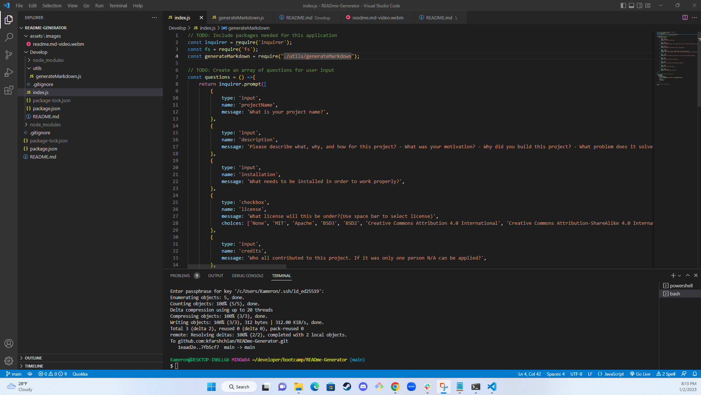
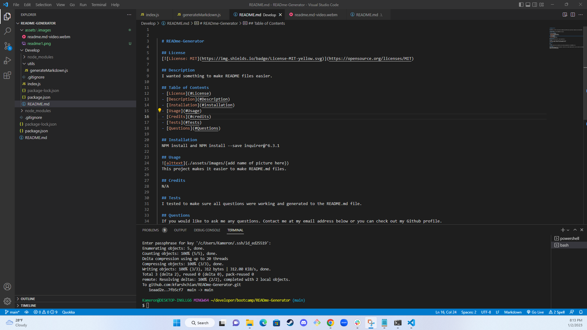

  # READme-Generator

  ## License
  

  ## Description
  I wanted something to make README files easier. 

  ## Table of Contents
  - [License](#License)
  - [Description](#Description)
  - [Installation](#installation)
  - [Usage](#Usage)
  - [Credits](#credits)
  - [Tests](#Tests)
  - [Questions](#Questions)
  
  ## Installation
  NPM install and NPM install --save inquirer@^6.3.1

  ## Usage
  
  
  This project makes it easier to make README.md files.
  
  ## Credits
  N/A

  ## Tests
  I tested to make sure all questions were working and generated to the README.md file. 

  ## Questions
  If you would like to ask me any questions. Contact me at my email address below or you can check out my Github profile.
  Email-kfarshchian@gmail.com
  Github user name- kfarshchian
  
  
